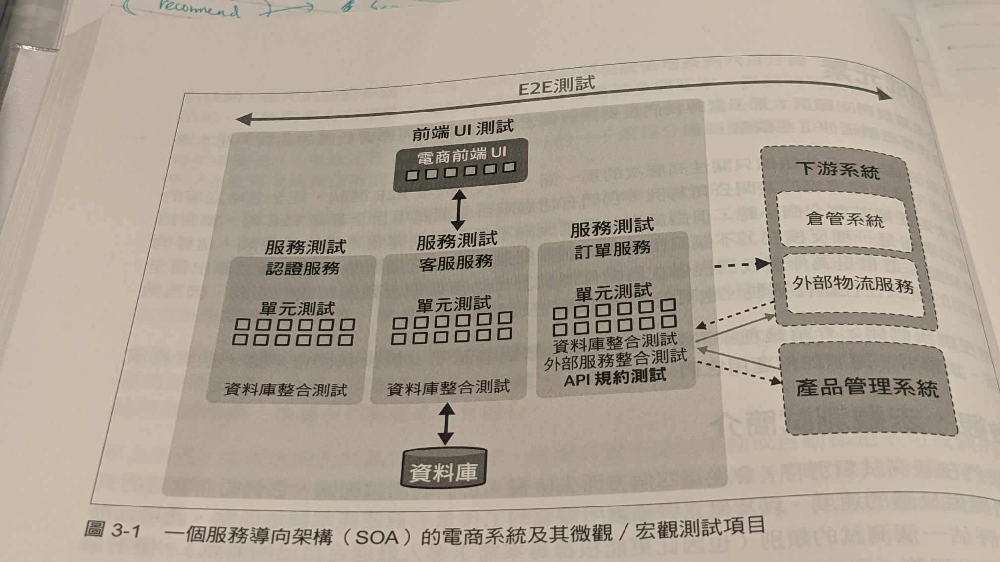

# 自動化測試

[ref - 全棧測試｜交付高品質軟體的實務指南](https://www.books.com.tw/products/0010961495)

1. 手動測試，隨著功能數量變多，需要測試的時間會指數成長，例如改動了 A ，連同A相關的功能有3個，改了 B ， B 和 A 連動，改 B --> 測試 B, 測試 A, 測試 A 相關

2. 也因此我們需要自動化測試來降低測試成本

3. 該功能關聯到的周邊功能 - 該測試稱為回歸測試 (Regression Test)

4. 測試的微觀與宏觀
    * 宏觀 - top level
    * 微觀 - bottom level

</img>

* 每個層面有其適合的測試

|測試名稱|測試範圍|測試目的|提供反饋的速度|建立與維護所需要的工作量|
|-------|------|-------|------------|--------------------|
|單元測試|每個函數|單一功能是否正常|快速  |小|
|整合測試|與外部元件串接|串接元件是否正常|較慢、取決於外部的回應速度  |中|
|API測試|API接口的輸入與輸出|API 輸入與輸出格式是否正確，是否能取得回應|實際實行很快，但有外部團隊的溝通成本、取決於外部的回應速度  |中|

* 單元測試 - e.g. 電商訂單服務 (return order total)
    * 模擬折扣 - item_prices 以負數傳入，驗證總金額
    * item_prices 空值傳入，驗證總金額
    * item_prices 填入無效字元，驗證總金額
    * item_prices 填入不同幣別，驗證總金額
    * item_prices 驗證小數點後3位數
    * 一般由開發者撰寫
    * TDD 團隊可更早讓功能完整

* 整合測試 - 對內與對外的串接
    * 前端 UI, 資料庫, 快取, 檔案系統
    * 驗證元件之間的行為，而非 End2End
    * 整合測試腳本仍然和程式碼放在一起
    * 測試要跑多久局限於外部系統的回應時間

* API 規約測試
    * 串接的另一端也還在開發，整合測試就測無可測，這發生在大型應用上，被切分成好幾個團隊，每個團隊負責幾個服務，服務之間制定各自的 API Spec
    * 用於測試 API 是否給定參數，可以正常回應，而不是測試回覆資料是否正確
    * 測試規模小，跑得快，共存於程式碼內，但需要和外部團隊溝通，溝通成本會較高
    * 測試工具如 Postman, Pact

* 服務測試

* UI 功能測試

* E2E 測試

* 自動化功能測試策略

# Applications

* ML Pipeline integrations
    * usually needs download, upload dataset/model from bigquery / gcs (batch)
    * usually needs download, upload dataset/model from redis (micro-batch , streaming)
    * cannot ask for high coverage unit-test
        * different role/titles
        * ml-pipeline code usually needs too much data transformation, too much work....
    * training / prediction may needs a lot of computation resource

* strategy
    * automatic integration test - time saving (**1.5 days --> immediately**)
    * if ENV == DEV, samples = samples[:1000] (to speed up)
