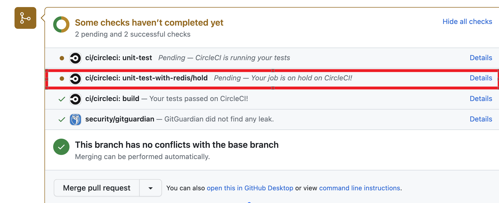
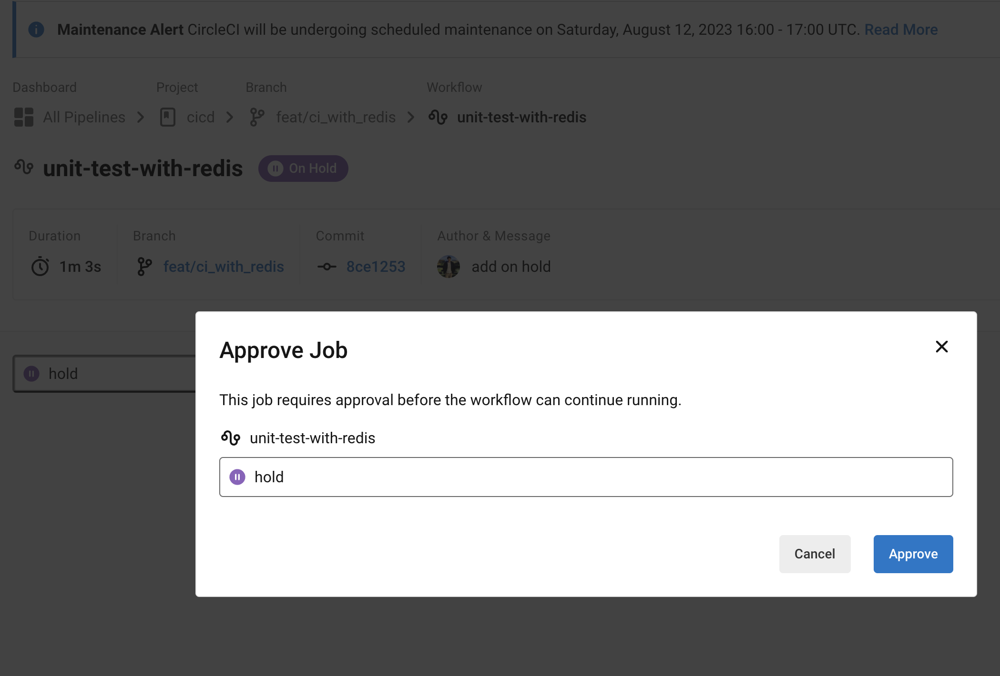

# Video and books

1. following as a course - [youtube](https://www.youtube.com/watch?v=vEkoSTkLMzQ&list=PL9GgS3TcDh8x6tcY7HDq2zmEx0fAtwWsM&index=10)
    * getting start with circleci
    * first green build
    * started with pre-built docker images
    * connecting bitbucket
    * schefule build 
    * multiple jobs with workflows
    * use docker layer cacheing to speed up your bui;ds
    * build/test/deploy react native projects
    * customize docker images for circleci 2.0
    * set ip CI and CD workflows for your Saleforce App
    * Setup circleCI & Jira
    * getting start with circleci and python flask
    * circleci and nodejs
    * circleci and terraform
    * circleci orbs - commands, executors and jobs that everyone can share.
    * deployments on circleci
    * cacheing on circleci
    * persisting data with workspace, cacheing, and artifacts
    * start your path to test parallelism by avoid these common problems
    * circleci/config.yml
    * dynamic configurations
    * what is circleci runner
    * webhook
    * circleci insights
    * scheduled pipelines

2. [全棧測試｜交付高品質軟體的實務指南](https://www.books.com.tw/products/0010961495)

# CircleCI features checklist

- [ ] abc
- [x] def

1. (checked) how to access CI env by ssh?

    [ref](https://www.hwchiu.com/circleci.html)

2. how to add environment varaibles to CircleCI

    * [ref](https://ithelp.ithome.com.tw/articles/10230182)
    * [video](https://www.youtube.com/watch?v=o4db-dv9q1c)
    * [CircleCI - 授權 GCP](https://circleci.com/docs/authorize-google-cloud-sdk/#installing-the-google-cloud-sdk)
        * 開 service account
        * 用 google-sdk image
        * 設定環境變數
            * project_id, default compute engine zone - 直接給 string
            * service_account - convert to base64 string
                * `cat service_account.json | base64 ` 
        * 可用 circleci，也可用 gcr

3. (checked) how to stack docker layer such as redis in ci env?

    [ref](https://circleci.com/developer/images/image/cimg/redis)

4. (checked) conditional trigger (hold)

    [ref](https://circleci.com/blog/adding-approval-jobs-to-your-ci-pipeline/)

    [ref](https://hddhyq.github.io/2019/01/25/CircleCI%E7%AE%80%E5%8D%95%E6%A6%82%E5%BF%B5/)

</img>

</img>